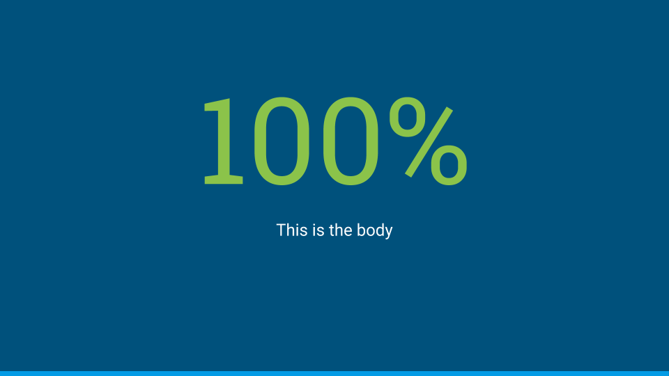

Generate Google Slides from markdown 

## Installation and usage

Get your OAuth client ID credentials:

* Create (or reuse) a developer project at <https://console.developers.google.com>
* Enable Google Slides API at [API library page](https://console.developers.google.com/apis/library)
* Go to [Credentials page](https://console.developers.google.com/apis/credentials) and click "+ Create credentials" at the top
* Create "OAuth client ID" type of credentials.
* Choose type "Computer Application" and give it some name.
* Download client ID/secret file and shorten the name to: `client_id.json`.
* Move `client_id.json` onto your disk.

After installing, import your slides by running:

```sh
bun src/index.ts -f examples/example.md --client_id client_id.json
```

You'll get a slide deck named "example.md".

> NOTE: The first time you run the `md2gslides` command, you will be prompted for authorization. OAuth token credentials are stored in `~/.md2googleslides/credentials.json`. You may get a "scary-looking" screen that says, "Google hasn't verified this app." Click "Advanced" then "Go to _APP-NAME_ (unsafe)" if you trust yourself as the author of the app that's requesting to access your Slides files in Drive.

## Supported markdown rules

md2gslides uses a subset of the [CommonMark](http://spec.commonmark.org/0.26/) and
[Github Flavored Markdown](https://help.github.com/categories/writing-on-github/) rules for
markdown.

### Slides

Each slide is typically represented by a header, followed by zero or more block elements.

Begin a new slide with a horizontal rule (`---`). The separator
may be omitted for the first slide.

The following examples show how to create slides of various layouts:

#### Title slide

<pre>
    ---

    # This is a title slide
    ## Your name here
</pre>


#### Section title slides

<pre>
    ---

    # This is a section title
</pre>


#### Section title & body slides

<pre>
    ---

    # Section title & body slide

    ## This is a subtitle

    This is the body
</pre>


#### Title & body slides

<pre>
    ---

    # Title & body slide

    This is the slide body.
</pre>


#### Main point slide

Add `{.big}` to the title to make a slide with one big point

<pre>
    ---

    # This is the main point {.big}
</pre>


#### Big text slide

Use `{.big}` on a `#` header in combination with no body.

<pre>
    ---

    # 100% {.big}
</pre>


#### Big number slide

Use `{.big}` on a header in combination with a body too.

<pre>
    ---

    # 100% {.big}

    This is the body
</pre>




#### Two column slides

Separate columns with `{.column}`. The marker must appear
on its own line with a blank both before and after.

<pre>
    ---

    # Two column layout

    This is the left column

    {.column}

    This is the right column
</pre>


### Themes

`md2googleslides` does not edit or control any theme related options. Just set a base theme you want on Google Slides directly.
Even if you will use `--append` option for deck reuse, theme will be not changed.

### Images

#### Inline images

Images can be placed on slides using image tags. Multiple images can be included. Mulitple images in a single paragraph are arranged in columns, multiple paragraphs arranged as rows. **NOTE:** Images are currently scaled and centered to fit the
slide template.

<pre>
    ---

    # Slides can have images

    
</pre>


#### Background images

Set the background image of a slide by adding `{.background}` to
the end of an image URL.

<pre>
    ---

    # Slides can have background images

    {.background}
</pre>


### Videos

Include YouTube videos with a modified image tag.

<pre>
    ---

    # Slides can have videos

    @[youtube](MG8KADiRbOU)
</pre>


### Speaker notes

Include speaker notes for a slide using HTML comments. Text inside
the comments may include markdown for formatting, though only text
formatting is allowed. Videos, images, and tables are ignored inside
speaker notes.

<pre>
    ---

    # Slide title

    {.background}

    &lt;!--
    These are speaker notes.
    --&gt;
</pre>

### Formatting

Basic formatting rules are allowed, including:

* Bold
* Italics
* Code
* Strikethrough
* Hyperlinks
* Ordered lists
* Unordered lists

The following markdown illustrates a few common styles.

<pre>
**Bold**, *italics*, and ~~strikethrough~~ may be used.

Ordered lists:
1. Item 1
1. Item 2
  1. Item 2.1

Unordered lists:
* Item 1
* Item 2
  * Item 2.1
</pre>

You **CAN NOT** mix ordered and unordered lists when nesting lists. For example this is invalid:
<pre>
* Item 1
    1. INVALID Item 1.1
* Item 2
    2. INVALID Item 2.1
</pre>

Additionally, a subset of inline HTML tags are supported for styling.

* `<span>`
* `<sup>`
* `<sub>`
* `<em>`
* `<i>`
* `<strong>`
* `<b>`

Supported CSS styles for use with `<span>` elements:

* `color`
* `background-color`
* `font-weight: bold`
* `font-style: italic`
* `text-decoration: underline`
* `text-decoration: line-through`
* `font-family`
* `font-variant: small-caps`
* `font-size` (must use points for units)

You may also use `{style="..."}` [attributes](https://www.npmjs.com/package/markdown-it-attrs)
after markdown elements to apply styles. This can be used on headers, inline
elements, code blocks, etc.

### Emoji

Use Github style [emoji](http://www.webpagefx.com/tools/emoji-cheat-sheet/) in your text using
the `:emoji:`.

The following example inserts emoji in the header and body of the slide.

<pre>
### I :heart: cats

:heart_eyes_cat:
</pre>

### Code blocks

Both indented and fenced code blocks are supported, with syntax highlighting.

The following example renders highlighted code.

<pre>
### Hello World

```javascript
console.log('Hello world');
```
</pre>

To change the syntax highlight theme specify the `--style <theme>` option on the
command line. All [highlight.js themes](https://github.com/isagalaev/highlight.js/tree/master/src/styles)
are supported. For example, to use the github theme

```sh
md2gslides slides.md --style github
```

You can also apply additional style changes to the entire block, such as changing
the font size:

<pre>
### Hello World

```javascript
console.log('Hello world');
```{style="font-size: 36pt"}
</pre>


### Tables

Tables are supported via
[GFM](https://guides.github.com/features/mastering-markdown/#GitHub-flavored-markdown) syntax.

Note: Including tables and other block elements on the same slide may produce poor results with
overlapping elements. Either avoid or manually adjust the layout after generating the slides.

The following generates a 2x5 table on the slide.

<pre>
### Top pets in the United States

Animal | Number
-------|--------
Fish   | 142 million
Cats   | 88 million
Dogs   | 75 million
Birds  | 16 million
</pre>


## Reading from standard input

You can also pipe markdown into the tool by omitting the file name argument.

## License

This library is licensed under Apache 2.0. Full license text is available in [LICENSE](LICENSE).
